### ESPAÑOL

>[english_documentation](#english)

<div align="center">

# SECCIÓN DE README

</div>

<p align=center>En esta sección, te informaremos sobre todos los aspectos técnicos importantes relacionados con la aplicación. Así como su instalación, características y todo lo necesario en caso de que desees explorar la aplicación o contribuir al proyecto.</p>

### Índice de contenido :

- [asuntos/pendientes](#asuntospendientes)

- [resumen](#resumen)

- [características](#características)

- [cómo usar](#cómo-usar)

- [tecnologías](#tecnologías)

- [instalación](#instalación)

- [diseño/Estructura](#diseñoestructura)

- [contacto](#contacto)

<br><br><br>


# Asuntos/Pendientes

Durante el desarrollo de este proyecto, enfrenté desafíos relacionados con el enrutamiento debido a la falta de soporte de backend. Al desarrollar la aplicación completamente en el frontend, el enrutamiento se volvió complicado al intentar acceder a diferentes secciones de la aplicación a través de la URL. Sin embargo, la navegación dentro de la interfaz de usuario no presentaba problemas.

En la etapa de desarrollo, la aplicación funcionaba correctamente, pero problemas surgieron al llevarla a producción ya que no había contemplado adecuadamente el manejo del enrutamiento. Aunque consideré que la solución podría ser implementar un enrutamiento más robusto, como el enrutamiento del lado del servidor, opté por una solución más rápida para mantener el enfoque en la funcionalidad principal de la aplicación.

Implementé la solución de utilizar hash-based routing, que inicialmente resolvió el problema de enrutamiento. Sin embargo, esta solución introdujo nuevos problemas, especialmente en la sección README. Aquí, la navegación dentro de la sección se volvió problemática ya que al hacer clic en los enlaces del índice de contenido, la URL cambiaba y dificultaba encontrar la nueva ruta.

En conclusión, aunque la solución de hash-based routing proporcionó una solución temporal para el problema inicial de enrutamiento, destacó la necesidad de abordar adecuadamente el enrutamiento en futuras iteraciones de la aplicación. Se considerarán opciones más robustas y escalables para el manejo del enrutamiento en el futuro, garantizando una experiencia de usuario fluida y sin problemas.

<br><br><br>

# Resumen


<div align="center">

# ¡Bienvenido a la aplicación del clima!
### Esta es una aplicación interactiva desarrollada con React que te permite explorar el clima actual y las previsiones futuras de manera simple y dinámica

</div>

> ### CARACTERÍSTICAS Y FUNCIONES:
>
> - Mantente informado sobre el clima en tiempo real con datos precisos
> - Obtén los datos más relevantes para organizar tu semana
> - Imágenes animadas dinámicas del clima actual para una mejor comprensión
> - Utiliza la unidad de medida según tu región (Fahrenheit o Celsius)
> - Personaliza el idioma a tu preferencia (inglés o español)
> - Personaliza el tema a tu gusto (tema claro o tema oscuro)
> - Guarda un registro de las búsquedas exitosas realizadas, es decir, un historial de búsqueda
> - Sección de preguntas frecuentes para aclarar dudas
> - Sección de Readme para aspectos más técnicos
> - Sección de contacto para compartir tu experiencia de usuario
> - Redes sociales de contacto para colaborar o trabajar juntos
> - Mensajes intuitivos sobre errores de uso e información
> - En caso de una ubicación inexistente o error de sintaxis en la búsqueda, redirección a una página 404 con información sobre lo sucedido

### CAPTURAS DE PANTALLA

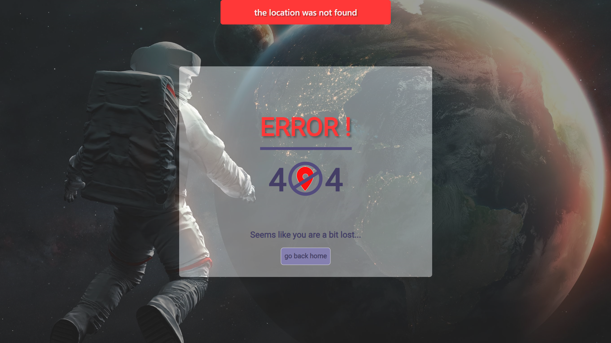

<br>
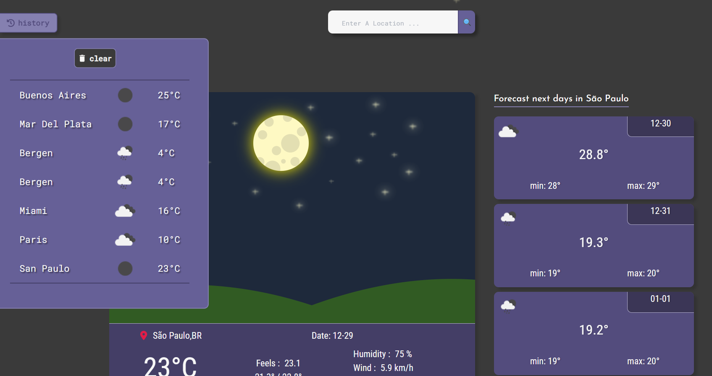

<br>
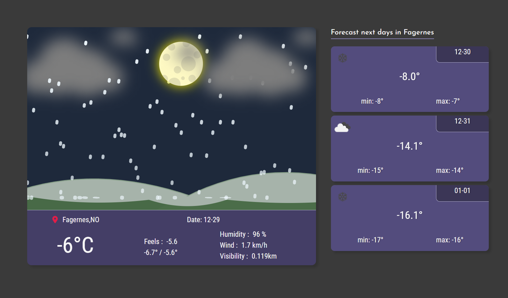

<br>
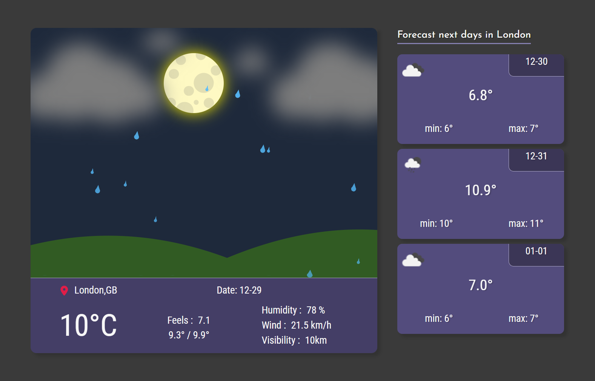

<br>
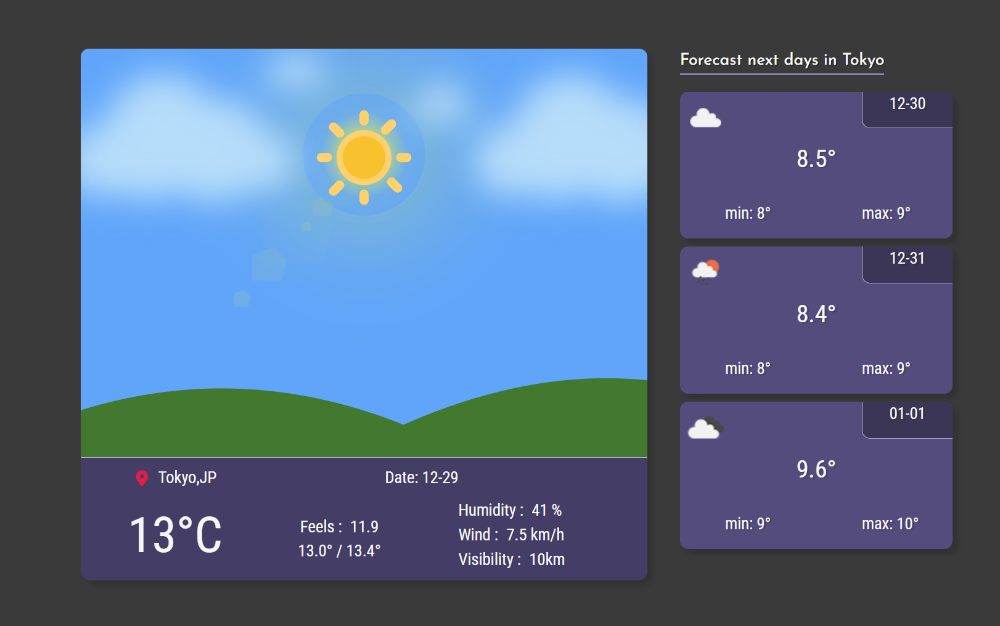

<br>
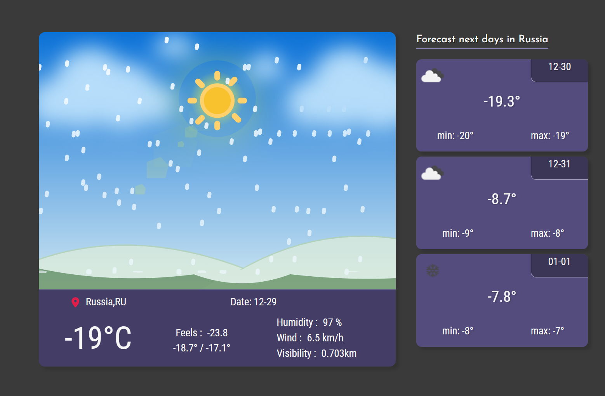

<br>
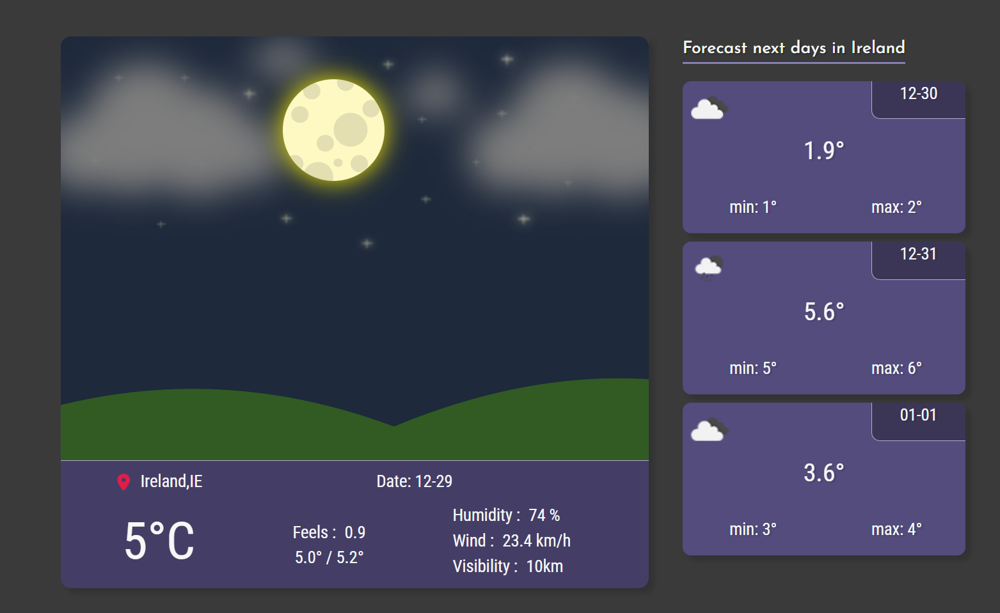

<br><br><br>

# Características

<div align="center">


## 💡 Puedes ajustar la aplicación según tus preferencias:

#### 1- Haz clic en el menú hamburguesa en la esquina superior derecha.


<br>

#### 2- Haz clic en la opción "preferencias".

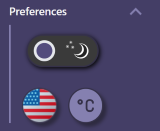

<br>

#### 3- Configura el idioma, el tema y la unidad de temperatura según tus preferencias 🙂

---

</div>

<br>

> ### Funciones clave
>
> - Tema personalizable: con la capacidad de cambiar entre temas claro y oscuro, adaptamos la experiencia visual a tu preferencia.
> - Idiomas disponibles: disfruta de la aplicación en español o inglés. ¡Elige tu idioma favorito para una experiencia más cómoda y personalizada!
> - Unidades de medida: puedes seleccionar la unidad de temperatura que prefieras, ya sea Fahrenheit o Celsius. ¡Nos adaptamos a tus necesidades y preferencias!

<br>

---

<br>

> ### Funciones destacadas
>
> - Visualización detallada: presentamos el clima para los próximos 3 días con información detallada y fácil de entender.
> - Datos dinámicos de la API: mostramos datos precisos extraídos de la API y proporcionamos imágenes correspondientes de manera dinámica para ofrecer una experiencia enriquecedora.

<br><br><br>

# Cómo usar

<div align="center">

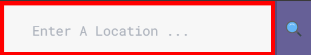

Asegúrate de ingresar la ubicación deseada de manera correcta y semántica, ya que cualquier error de sintaxis podría redirigirte a la página "no encontrada", indicando que la búsqueda no existe. También es importante evitar el uso de acentos y especificar el país. Simplemente ingresar la ciudad en la búsqueda es suficiente.


<br><br>

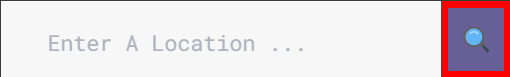

Asegúrate de que el campo de texto no esté vacío, ya que de lo contrario no podrás continuar. Sin embargo, la aplicación es intuitiva y mostrará un mensaje con información adicional. El mismo proceso debe seguirse después de cada búsqueda exitosa.

<br><br>

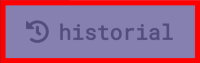

Antes de realizar una búsqueda, asegúrate de configurar la aplicación previamente. Para ser más preciso, configura la unidad de medida de temperatura, ya que los datos almacenados se guardan en grados dependiendo de si prefieres Fahrenheit o Celsius.
</div>
<br><br><br>

# Tecnologías

<br>

<div align="center">

<h3>Para este proyecto, se utilizaron las siguientes tecnologías:</h3>

<br>

### **Node.js :**

_utilizado como gestor de paquetes para el proyecto_

<br>

### **React.js :**

_utilizado como base del proyecto para la interfaz de usuario_

<br>

### **React Icons :**

_utilizado para iconos dentro del proyecto_

<br>

### **Sass :**

_utilizado para estilos en toda la aplicación_

<br>

### **Tailwind :**

_utilizado para estilizar la mayoría de las tarjetas meteorológicas en ./src/components/WeatherCards por su simplicidad y fácil implementación._

<br>

### **Zustand :**

_utilizado como gestor de estado global_

<br>

### **Wouter :**

_utilizado para el enrutamiento de la aplicación._

<br>

### **Eslint / Prettier :**

_utilizado para mantener la consistencia del código y aplicar estilos de codificación._

<br>

### **Recurso/API :**

<a href="https://openweathermap.org/" target="blank_">https://openweathermap.org/</a>

</div>

<br><br><br>

# Instalación

Si deseas contribuir al proyecto, asegúrate de bifurcar el repositorio y luego sigue las instrucciones paso a paso.

### # Clona el repositorio.

```
$ git clone https://github.com/SebaPerez90/WeatherApp.git

```

### # Entra en el repositorio.

```
$ cd WheaterApp

```

### # Instala las dependencias

```
$ npm install

```

### # Inicia un servidor local para previsualizar el sitio..

```
$ npm run dev

```

### # Ajusta el linter y el formateador según tus preferencias de desarrollo.

```
ESLint - ./eslintrc.cjs
se utiliza como linter para mantener la consistencia en el código.

Prettier - ./prettierrc
se utiliza como formateador para garantizar un estilo consistente en el código fuente.

```

<br><br><br>

# Diseño/Estructura

```

./src
/assets
/images               //contiene todas las imágenes
/svg                  //contiene los SVG utilizados con frecuencia

/components
/Footer               //contiene todos los componentes del pie de página
/Header               //contiene todos los componentes del encabezado
/Weather Cards        //contiene todas las tarjetas de condiciones meteorológicas.

CardInfo.jsx          //renderea los datos extraídos de la API y su imagen correspondiente dinámicamente.
ForecastNextDays.jsx  //renderea el clima para los próximos 3 días.
History.jsx           //componente de historial de búsqueda
Main.jsc              //tarjeta principal del proyecto
OverviewApp.jsx       //componente de resumen
WeatherCards.jsx      //renderea el clima dinámicamente según la búsqueda realizada

/routes
Contact.jsx           //componente de contacto para proporcionar comentarios sobre la aplicación
NotFound.jsx          //se renderea cuando la respuesta de la consulta es 404.
Readme.jsx            //contiene toda la documentación sobre cómo funciona la aplicación

/styles
animations.scss        //contiene animaciones utilizadas con frecuencia.
dark-theme.scss        //contiene todas las propiedades cuando el "tema oscuro" está activo.
light-theme.scss       //contiene todas las propiedades cuando el "tema claro" está activo.
weather-cards.scss     //contiene estilos específicos para los componentes "Weather Cards".

App.jsx
Main.jsx


```

<br><br><br>

# Contacto

<div align="center">

### _Este proyecto fue desarrollado por_ **Sebastian Perez**


    
<br>

</div>

### Si estás interesado en colaborar o trabajar juntos, te invito a ponerte en contacto conmigo.

- **Linkedin :** [https://www.linkedin.com/in/sebaperez90/](https://www.linkedin.com/in/sebaperez90/)

<br>

- **Github :** [https://github.com/SebaPerez90](https://github.com/SebaPerez90)

<br>

- **Correo electrónico:** sebastian.perez.jobs@gmail.com

<br>

<div align="center">

[⬆️](#sección-de-readme)

</div>

<br><br><br><br>

***

<br><br><br><br>

### ENGLISH
>[documentación_en_español](#español)

<div align="center">

# README SECTION

</div>

<p align=center>In this section, we will inform you about all the important technical aspects related to the application. As well as its installation, features, and everything necessary in case you want to explore the application or contribute to the project</p>

### Index of content :

- [issues](#issues)

- [overview](#overview)

- [features](#features)

- [how to use](#how-to-use)

- [technologies](#technologies)

- [installation](#installation)

- [design/structure](#designstructure)

- [contact](#contact)

<br><br><br>

# Issues

During the development of this project, I faced challenges related to routing due to the lack of backend support. Developing the application entirely on the frontend made routing complicated when attempting to access different sections of the application via the URL. However, navigation within the user interface posed no issues.

In the development stage, the application worked correctly, but problems arose when deploying it to production as I had not adequately considered routing management. Although I considered that the solution could be implementing more robust routing, such as server-side routing, I opted for a quicker solution to maintain focus on the core functionality of the application.

I implemented the solution of using hash-based routing, which initially resolved the routing problem. However, this solution introduced new problems, especially in the README section. Here, navigation within the section became problematic as clicking on index content links caused the URL to change, making it difficult to find the new route.

In conclusion, although the hash-based routing solution provided a temporary fix for the initial routing problem, it highlighted the need to properly address routing in future iterations of the application. More robust and scalable routing management options will be considered in the future to ensure a seamless and hassle-free user experience.

<br><br><br>

# Overview


<div align="center">

# Welcome to the Weather App!
### This is an interactive application developed with React that allows you to explore the current weather and future forecasts in a simple and dynamic way

</div>

> ### FEATURES AND CHARACTERISTICS:
>
> - Stay informed about real-time weather with accurate data
> - Get the most relevant data to organize your week
> - Dynamic animated images of the current weather for better understanding
> - Use the measurement unit according to your region (Fahrenheit or Celsius)
> - Customize the language to your preference (English or Spanish)
> - Customize the theme to your liking (light theme or dark theme)
> - Keep a record of successful searches made, i.e., a search history
> - FAQ section to clear doubts
> - Readme section for more technical aspects
> - Contact section to share your user experience
> - Contact social networks to collaborate or work together
> - Intuitive messages about usage errors and information
> - In case of a non-existing location or syntax error in the search, redirect to a 404 page with information about what happened

### SCREENSHOTS


<br>


<br>


<br>


<br>


<br>


<br>


<br><br><br>

# Features

<div align="center">


## 💡 You can adjust the app according to your preferences :

#### 1- Click on the hamburger menu at the top right.


<br>

#### 2- Click on the "preferences" option.


<br>

#### 3- Set up the language, theme, and temperature unit as you like 🙂

---

</div>

<br>

> ### Key Features
>
> - Customizable Theme : With the ability to switch between light and dark themes, we adapt the visual experience to your preference.
> - Available Languages : Enjoy the application in Spanish or English. Choose your favorite language for a more comfortable and personalized experience!
> - Measurement Units : You can select the temperature unit you prefer, either Fahrenheit or Celsius. We cater to your needs and preferences.

<br>

---

<br>

> ### Highlighted Features
>
> - Detailed Visualization : We present the weather for the next 3 days with detailed and easy-to-understand information.
> - Dynamic API Data : We display precise data extracted from the API and provide corresponding images dynamically to offer an enriching experience

<br><br><br>

# How to Use

<div align="center">


Make sure to enter the desired location correctly and semantically, as any syntax error might redirect you to the "not-found" page, indicating that the search does not exist. It is also important to avoid using accents and specify the country. Simply entering the city in the search is sufficient.


<br><br>


Make sure that the text field is not empty, as otherwise you won´t be able to proceed. However, the application is intuitive and will display a message with further information. The same process must be followed after each successful search.

<br><br>


Before conducting a search, make sure to set up the application beforehand. To be more precise, configure the temperature measurement unit, as the stored data is saved in degrees depending on whether you prefer Fahrenheit or Celsius.
</div>
<br><br><br>

# Technologies

<br>

<div align="center">

<h3>For this project, the following technologies were used:</h3>

<br>

### **Node.js :**

_used as the package manager for the project_

<br>

### **React.js :**

_used as the foundation of the project for the user interface_

<br>

### **React Icons :**

_used for icons within the project_

<br>

### **Sass :**

_used for styling throughout the application_

<br>

### **Tailwind :**

_used to style most of the weather cards in ./src/components/WeatherCards for its simplicity and easy implementation._

<br>

### **Zustand :**

_used as global state manager_

<br>

### **Wouter :**

_used for application routing._

<br>

### **Eslint / Prettier :**

_used to maintain code consistency and apply coding styles._

<br>

### **Resource/ API :**

<a href="https://openweathermap.org/" target="blank_">https://openweathermap.org/</a>

</div>

<br><br><br>

# Installation

If you want to contribute to the project, make sure to fork the repository and then follow the step-by-step instructions.

### # Clone the repository.

```
$ git clone https://github.com/SebaPerez90/WeatherApp.git

```

### # Go into repository.

```
$ cd WheaterApp

```

### # Install the dependencies

```
$ npm install

```

### # Start a local server to preview the site.

```
$ npm run dev

```

### # Adjust the linter and formatter according to your development preferences

```
ESLint - ./eslintrc.cjs
uses as a linter to maintain consistency in the code.

Prettier - ./prettierrc
used as a formatter to ensure a consistent style in the source code.

```

<br><br><br>

# Design/Structure

```

./src
/assets
/images               //contiene todas las imagenes
/svg                  //contains the SVG used frecuently

/components
/Footer               //contains all the components of the footer
/Header               //contains all the components of the header
/Weather Cards        //contains all the weather condition cards.

CardInfo.jsx          //it renders the data fetched from the API and its corresponding image dynamically.
ForecastNextDays.jsx  //it renders the weather for the next 3 days.
History.jsx           //search history component
Main.jsc              //main card of the project
OverviewApp.jsx       //overview component
WeatherCards.jsx      //renders the weather dynamically according to the search performed

/routes
Contact.jsx           //contact component to provide feedback about the application
NotFound.jsx          //renders when the query response is 404.
Readme.jsx            //contains all documentation about how the app works

/styles
animations.scss        //contains frequently used animations.
dark-theme.scss        //contains all the properties when the "dark theme" is active.
light-theme.scss       //contains all the properties when the "light theme" is active.
weather-cards.scss     //contains specific styles for the "Weather Cards" components.

App.jsx
Main.jsx

```

<br><br><br>

# Contact

<div align="center">

### _This proyect was developed by_ **Sebastian Perez**


    
<br>

</div>

### If you are interested in collaborating or working together, I invite you to get in touch with me.

- **Linkedin :** [https://www.linkedin.com/in/sebaperez90/](https://www.linkedin.com/in/sebaperez90/)

<br>

- **Github :** [https://github.com/SebaPerez90](https://github.com/SebaPerez90)

<br>

- **Email:** sebastian.perez.jobs@gmail.com

<br>

<div align="center">

[⬆️](#readme-section)

</div>
